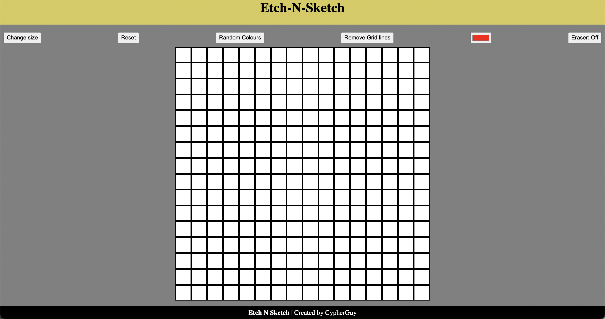

# Etch-N-Sketch

Etch-N-Sketch is a simple drawing application implemented in HTML, CSS, and JavaScript. Users can draw on a grid by hovering over or clicking on the squares, change the grid size, toggle grid lines, toggle random colors, and use an eraser.

This is part of The Odin Project.

## Features

- **Drawing:** Users can draw on the grid by hovering over or clicking on the squares.
- **Grid Size:** Users can change the grid size by specifying a number between 1 and 100.
- **Grid Lines:** Users can toggle grid lines on and off.
- **Random Colors:** Users can toggle random colors for drawing.
- **Eraser:** Users can toggle eraser mode to erase parts of their drawings.

## Usage

1. Clone this repository:

- git clone git@github.com:CypherGuy/Etch-a-Sketch.git

2. Open `index.html` in your web browser.

3. Use the buttons provided to interact with the drawing application:
   - Click "Change size" to specify a new grid size.
   - Click "Reset" to clear the grid.
   - Click "Random Colours" to toggle random color mode.
   - Click "Toggle Grid lines" to toggle grid lines visibility.
   - Use the color picker to choose a drawing color.
   - Click "Eraser: Off" to toggle eraser mode.

## Screenshots

## Contributing

Contributions are welcome! Please fork the repository and submit a pull request with your changes.

## License

This project is licensed under the MIT License - see the [LICENSE](LICENSE) file for details.
